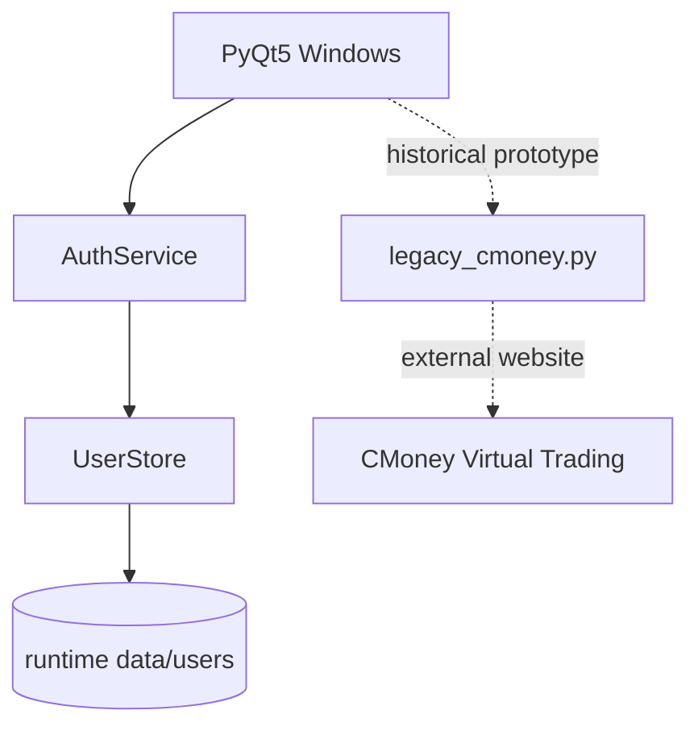

# Python Login System / Stock in the Game

> 2020 年完成的 PyQt5 桌面應用原型。專案最初從「登入系統」開始，後來一路加入帳號管理、修改密碼，以及 CMoney 虛擬股票交易資料的實驗性整合，因此實際內容早已超過 repository 名稱描述的範圍。

這個 repository 現在保留它作為一份早期 Python desktop application 的工程紀錄，同時對 authentication 與程式結構做現代化整理；原本很有 2020 年個人作品味道的 A350、和牛、藪貓、股票與維尼背景素材則刻意保留。

## 專案功能

### Desktop account flow

- 建立本機帳號
- 帳號登入 / 登出
- 修改密碼
- PyQt5 多視窗切換
- Error / success dialogs
- 密碼欄位遮罩與快捷鍵

### Historical stock prototype

專案後期另外發展出一套 CMoney 虛擬股市 integration prototype，曾實驗：

- CMoney 網站登入
- 取得帳戶資訊
- 委託查詢
- 虛擬股票下單 / 刪單
- 交易紀錄
- 庫存與損益資料

這部分目前保留在 `legacy_cmoney.py` 作為歷史紀錄。它依賴第三方網站當年的 HTML / endpoint 行為，**不視為目前仍受支援或可直接執行的 production integration**。

## 原始操作影片

2020 年留下的 demo：

https://youtu.be/GdhtmaLD4Vs

## Architecture



重構後各層責任：

| Layer | Responsibility |
| --- | --- |
| `main.py` | PyQt window lifecycle、navigation、UI events |
| `auth/service.py` | register、authenticate、change password、validation |
| `auth/storage.py` | user record file I/O、hashed filename、atomic write |
| Generated `*.py` / `*.ui` | Qt Designer UI definitions |
| `legacy_cmoney.py` | 2020 年 CMoney integration prototype |
| `tests/test_auth.py` | authentication unit tests |

## Authentication 重構

2020 原版直接把每個 user 存成：

```text
user_id/<username>.json
```

而且密碼以明文保存。這種寫法適合當年理解 file I/O 與登入流程，但不適合作為現在的示範。

重構後：

- password 使用 **PBKDF2-SHA256**
- 每個 password 都有 random salt
- password comparison 使用 constant-time comparison
- user id 不再直接成為檔名
- user record filename 使用 user id 的 SHA-256 digest
- 寫檔採 temporary file + `os.replace`
- runtime user data 不進 Git
- corrupted local record 不會讓整個 login flow crash

> 這仍然是一個 local desktop demo，不應被視為 production identity system。真實產品通常應使用成熟的 authentication / identity solution，而不是自己維護 local password database。

## Security history cleanup

這個 repository 過去曾把本機測試帳號 JSON 一起 commit 到 public Git history。

2026 年整理 repository 時已重寫 reachable history：

- 保留最初的 clean root commit
- 將目前專案內容重新建立成 sanitized snapshot
- 移除 tracked `user_id/`
- 移除 tracked `user.json`
- `.gitignore` 永久排除 runtime credential data

因此目前任何 branch 的正常 Git history 都不再包含那些 runtime user records。

GitHub 仍可能暫時保留 unreachable objects，已知舊 SHA 在 garbage collection 前可能仍能直接存取。若資料具有真實安全敏感性，仍應視為已洩漏並更換 credential；必要時再透過 GitHub sensitive-data removal 流程清除 cached/direct-SHA view。

## 專案結構

```text
.
├── auth/
│   ├── __init__.py
│   ├── service.py
│   └── storage.py
├── tests/
│   └── test_auth.py
├── picture/
│   └── ... historical UI assets
├── main.py
├── legacy_cmoney.py
├── mainOGC.py / mainOGC.ui
├── createaccount.py / createaccount.ui
├── editpassword.py / editpassword.ui
├── menuOGC.py / menuOGC.ui
├── OGC.py / OGC.ui
├── OGC2.py / OGC2.ui
└── requirements.txt
```

`*.ui` 是 Qt Designer source；對應的 Python files 是 PyQt UI generator 產物。Application behavior 主要放在 `main.py`，避免繼續把 authentication business logic 塞進 generated UI code。

## 執行方式

### 1. 建立 virtual environment

```bash
python -m venv .venv
```

macOS / Linux：

```bash
source .venv/bin/activate
```

Windows：

```powershell
.venv\Scripts\activate
```

### 2. 安裝 dependency

```bash
pip install -r requirements.txt
```

### 3. 啟動 desktop app

```bash
python main.py
```

預設 runtime user records 會建立在：

```text
data/users/
```

這個目錄已由 `.gitignore` 排除。

若想指定其他位置，可設定：

```bash
export LOGIN_SYSTEM_DATA_DIR=/your/private/path
python main.py
```

## Tests

Authentication layer 不依賴 PyQt，因此可以單獨測試：

```bash
python -m unittest discover -s tests -v
```

目前包含：

- register / login
- incorrect password
- duplicate user
- password confirmation
- minimum password length
- password hash 不保存 plaintext
- change password
- 防止 user id 造成 filesystem path traversal

## 2020 原版 vs. 重構後

| 2020 prototype | 現在 |
| --- | --- |
| UI event 直接讀寫 JSON | UI → `AuthService` → `UserStore` |
| plaintext password | PBKDF2-SHA256 + salt |
| username 直接組檔案路徑 | SHA-256 filename |
| `except:` 吞掉所有錯誤 | explicit validation / failure path |
| button event 裡重複 connect signal | signal 在初始化時設定一次 |
| 修改帳號欄位後用 error dialog 阻止 | account field 直接 read-only |
| `stock_test.py` 看起來像 automated test | `legacy_cmoney.py` 明確標示 historical integration |
| runtime account JSON 被 commit | runtime data 永久 ignored |

## 為什麼保留那些奇怪的圖片？

因為它們其實是這個作品最好玩的部分之一。

這個 GUI 在不同畫面用了股票、A350、和牛、藪貓、warning image 與維尼 icon。若把它們全部換成現在常見的乾淨 design system，程式會更一致，但也會失去這個 2020 個人作品原本的樣子。

所以這次整理採取的原則是：

> **修 security 與 architecture，不抹掉作品本身的時代感。**

## Historical limitations

- 原始專案建立於 2020 年，PyQt UI 與 Python dependency 可能需要依目前 OS / Python 版本調整。
- CMoney integration 依賴當年的網站 DOM、ASP.NET form fields 與 private-ish endpoints，今天很可能已改版或失效。
- repository 不再提供舊 `.exe` build；建議直接從 source 執行。
- 圖片素材是早期 prototype assets，這個 repository 主要把它們當歷史 UI context 保留。

## 專案定位

這不是一套準備部署到 production 的 authentication product，也不是目前可依賴的股票交易 client。

它比較適合作為一份完整的開發演進紀錄：

1. 從 Python GUI 與 local file storage 開始。
2. 做出 register / login / password update 的完整 desktop flow。
3. 再開始嘗試 HTTP session、web scraping 與虛擬交易 API。
4. 多年後重新檢視，將 authentication、storage、UI 與 legacy integration 拆開，並補上 security cleanup 與 tests。

對一個早期作品來說，這段演進本身比把它假裝成新的 production app 更值得保留。
